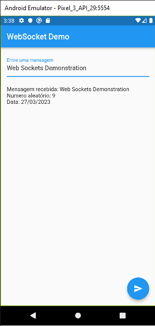

# web_sockets_demo

Simple app with objective to ***demonstrate*** the use of the locally websocket using a server in javascript
## JSON Preview
```json 
{
  "object":{
     "nome":"Web Sockets Demonstration",
     "data":"27/03/2023",
     "value":9
  }
}
```
## Install
- Clone repository ```git clone https://github.com/BrunoRabbit/web_sockets_demo```
- Install packages ```npm i``` or ```yarn```
- ```flutter pub get``` to get flutter packages
- Run server using ```cd server/``` and then ```node server.js```
- Finally use a emulator or real device to run the Flutter project

## App Preview
 
 
